# National Digital Platform for Research and Policy Innovation in Land Governance
### Complete Project Specification, Solution Approach, Requirement Breakdown, Technology Stack & Full Website Design

> **How to use this document:** This is written as a single, self-contained build brief. A development team, design team, or another AI tool should be able to read it start to finish and build the platform with no open questions. It moves from *why* (background/problem) → *what* (requirements) → *how* (technology) → *exactly what the user sees and clicks* (website design, page by page).

---

## PART 1 — COMPLETE PROJECT DESCRIPTION

### 1.1 Background

Land is India's most contested and most strategic resource. It sits at the intersection of economic growth, food security, urban expansion, environmental sustainability, and social equity. Every major national priority — agriculture, housing, infrastructure, industrial corridors, climate resilience, disaster management — ultimately depends on how land is recorded, allocated, used, and disputed.

Over the last two decades, India has made major investments in **land administration**: digitization of land records (DILRMP), cadastral mapping, satellite-based rural property mapping (SVAMITVA), geospatial platforms (Bhuvan/ISRO), and state-level portals (Bhulekh, Dharani, e-Dhara, and others). These systems are largely **transactional and implementation-focused** — they exist to record ownership, process mutations, issue certificates, and maintain registries.

What is missing is an equally strong **research and policy innovation layer** sitting on top of this administrative layer — a place where:

- Researchers can study land-use change, tenure security, and land disputes using real data.
- Policymakers can test a reform's likely impact before rolling it out nationally.
- Government departments can discover what other states or districts have already tried.
- Academic institutions and industry experts can collaborate instead of working in isolation.
- Vast existing datasets (land records, satellite imagery, GIS layers, socio-economic surveys, court/dispute data) are converted into **actionable evidence** rather than sitting unused in departmental silos.

Meanwhile, new pressures are accelerating: climate change (flooding, land degradation, coastal erosion), rapid and often unplanned urbanization, urban-rural land-use transition, rising land disputes and litigation backlogs, the need for sustainable land-use planning, and the broader push toward digital, geospatial governance under Digital India / National Geospatial Policy.

**The core gap:** abundant data + growing policy urgency, but no shared national platform to turn one into the other.

### 1.2 Problem Statement (Expanded)

1. Land governance research in India is fragmented across universities, think tanks, NITI Aayog-affiliated bodies, state departments, and individual researchers — with no common repository or coordination layer.
2. Datasets that could power research (land records, cadastral surveys, satellite imagery, GIS layers, scheme performance data) are held in disconnected departmental systems, often not machine-readable, rarely linked to research use cases.
3. There is no structured way to **experiment with policy before implementation** — reforms are usually tested by rolling them out live rather than simulated first, which is costly and politically risky if they fail.
4. Emerging, cross-cutting challenges — climate vulnerability, urban-rural land transition, land disputes, sustainable land-use planning — require **continuous, iterative research**, not one-off studies.
5. There is no single discovery layer: a policymaker in one state cannot easily find out whether a similar reform, pilot, or study has already been done elsewhere in the country.
6. Talent and grassroots innovation (students, startups, research scholars) have no dedicated national channel — no hackathons, grants, or pilot-project mechanism specific to land governance.
7. Decision-makers lack real-time, visual, and evidence-backed dashboards showing how land-related programmes are actually performing on the ground.

### 1.3 Vision Statement

To build a secure, AI-enabled, national digital ecosystem that converts India's land-related data, research, and institutional knowledge into a continuously usable resource for evidence-based policymaking — enabling faster, safer, and more transparent land governance reforms.

### 1.4 Objectives

| # | Objective | What success looks like |
|---|-----------|--------------------------|
| O1 | Centralize land governance knowledge | One searchable home for research, policy documents, datasets, case studies — instead of scattered PDFs and portals |
| O2 | Make discovery effortless | AI-powered search surfaces relevant work in seconds instead of manual literature review |
| O3 | Enable safe policy experimentation | Reforms can be simulated and stress-tested before real-world rollout |
| O4 | Visualize land governance spatially | Every relevant metric (land-use, disputes, climate risk) viewable on a map, not just in a spreadsheet |
| O5 | Encourage collaboration | Researchers, government staff, and institutions can co-work on the same platform instead of emailing files |
| O6 | Fuel grassroots innovation | Hackathons, grants, and pilots give students/startups a formal channel into land governance reform |
| O7 | Maintain trust and control | Role-based access, audit trails, and data security appropriate for a national government platform |
| O8 | Interoperate, not duplicate | Plug into existing government systems (DILRMP, Bhuvan, state land portals) via APIs rather than replacing them |

### 1.5 Key Stakeholders

| Stakeholder Group | Primary Needs | Platform Role |
|---|---|---|
| **Researchers / Academics** | Access to data, publishing outlet, collaboration tools | Upload research, run analysis, join workspaces |
| **Policymakers (Central/State)** | Evidence, simulations, dashboards | Evaluate policy options, monitor KPIs |
| **Government Departments** | Data sharing, program monitoring | Contribute datasets, track programme outcomes |
| **Academic Institutions** | Repository, grants, student projects | Institutional accounts, publish case studies |
| **Industry / GIS & AI Experts** | API access, innovation challenges | Build tools, participate in hackathons |
| **Judiciary / Legal Researchers** | Land dispute data and trends | Read-only analytics access |
| **General Public** | Transparency, awareness | View public dashboards, limited search |
| **Platform Administrators** | Governance, moderation, uptime | Manage users, content, security, audits |

### 1.6 Scope of Study

| # | Scope Area | Description | Primary Contributors | Deliverable |
|---|------------|--------------|----------------------|-------------|
| 1 | Knowledge Repository | Centralize research papers, policy papers, legal/statutory documents, case studies, reports | Govt departments, universities, research bodies | Searchable digital library with metadata standards |
| 2 | Data Integration | Bring together land records, cadastral data, satellite imagery, socio-economic and GIS datasets | DILRMP, NIC, ISRO/Bhuvan, Census, State Revenue Depts | Unified, interoperable data layer with common schema |
| 3 | Emerging Challenges Research | Climate change impact, urbanization, urban-rural land transitions, disputes, sustainable land-use planning | Policymakers, researchers, planners | Curated thematic research tracks and living reports |
| 4 | AI-Powered Discovery | Semantic search, recommendations, automated literature synthesis | Researchers, officials, public | Search/recommendation engine with relevance ranking |
| 5 | Geospatial Analysis | Land-use pattern mapping, climate vulnerability layers, infrastructure and policy-impact overlays | GIS analysts, urban/rural planners | Interactive web-GIS explorer |
| 6 | Analytics & Decision Support | Trend detection, effectiveness scoring of past policies | Think tanks, government analytics units | Dashboards + downloadable analytical reports |
| 7 | Policy Simulation | Model likely outcomes of a proposed reform before it is implemented | Policymakers, academic modelers | Scenario simulation module with outcome ranges |
| 8 | Collaboration Infrastructure | Shared project spaces, joint document editing, discussion threads | Cross-institutional teams | Persistent collaborative workspaces |
| 9 | Innovation & Talent Pipeline | Hackathons, research grants, pilot project tracking, competitions | Startups, students, academia, government | Innovation portal with submission and evaluation workflow |
| 10 | Access, Security & Governance | Role-based permissions, data protection, auditability | All users, platform admins | RBAC system compliant with DPDP Act, 2023 |
| 11 | Interoperability | APIs to connect with existing government/GIS/research systems | NIC, state land portals, ISRO, research databases | Public + partner API layer with documentation portal |

---

## PART 2 — SOLUTION APPROACH (SOFTWARE)

### 2.1 Solution Philosophy / Design Principles

1. **Evidence over assumption** — every dashboard, simulation, and recommendation must be traceable back to a source dataset or document (full provenance chain).
2. **Interoperate, don't replace** — the platform is a research/policy layer *on top of* existing land administration systems, connected via APIs, not a replacement for DILRMP or state land portals.
3. **Federated data, centralized discovery** — datasets can remain with their owning department; the platform indexes metadata and (where permitted) mirrors data for analysis, always preserving source attribution.
4. **Security and role-based trust by default** — since this handles government and citizen-relevant land data, every module is designed access-controlled first, open second.
5. **AI as an assistant, not an oracle** — AI search, synthesis, and simulation always show confidence levels and underlying sources; nothing is presented as unquestionable ground truth.
6. **Progressive access** — public users see aggregated, non-sensitive dashboards; verified researchers/officials get deeper access; admins control what is promoted to "public."
7. **Built for scale and incremental growth** — architected so new datasets, new states, and new institutions can be onboarded without re-architecting the system.
8. **Multilingual and accessible by default** — English + Hindi + major regional languages, WCAG-compliant, usable on low-bandwidth connections.

### 2.2 High-Level Architecture

```mermaid
flowchart TB
    subgraph Sources["Data Sources"]
        A1[Land Records / DILRMP]
        A2[Satellite Imagery / Bhuvan-ISRO]
        A3[GIS Layers / State Portals]
        A4[Socio-Economic & Census Data]
        A5[Research Papers & Policy Docs]
        A6[Court / Dispute Records]
    end

    subgraph Ingest["Ingestion & Processing Layer"]
        B1[ETL Pipelines]
        B2[Metadata Extraction & Tagging]
        B3[Geospatial Normalization]
        B4[Document Parsing & OCR]
    end

    subgraph Storage["Storage Layer"]
        C1[(PostgreSQL + PostGIS)]
        C2[(Object Storage - Documents/Rasters)]
        C3[(Search Index)]
        C4[(Vector Database)]
    end

    subgraph Services["Core Services"]
        D1[AI Search & Recommendation Engine]
        D2[GIS Map & Visualization Service]
        D3[Analytics & Decision-Support Engine]
        D4[Policy Simulation Engine]
        D5[Collaboration Service]
        D6[Innovation Portal Service]
    end

    subgraph Access["API & Security Layer"]
        E1[API Gateway]
        E2[Identity & Role-Based Access - Keycloak]
        E3[Audit & Logging]
    end

    subgraph Frontend["Platform Frontend"]
        F1[Web Portal]
        F2[Dashboards]
        F3[Developer / API Portal]
    end

    Sources --> Ingest --> Storage --> Services --> Access --> Frontend
```

### 2.3 Core Software Modules (Mapped to Requirements)

| Module | Purpose | Maps to Requirement # |
|---|---|---|
| Repository & Content Management | Store/organize research, policy, legal documents, case studies | 1 |
| AI Search & Recommendation Engine | Semantic + keyword search, "related work" suggestions | 2 |
| Collaboration Workspace Service | Shared projects, document co-editing, discussions | 3 |
| GIS Visualization Engine | Interactive maps for land-use, climate, infra, policy impact | 4 |
| Analytics & Decision-Support Engine | Policy-effectiveness scoring, trend detection | 5 |
| Policy Simulation Engine | Scenario modeling of proposed reforms | 6 |
| Data Integration Layer | Ingests satellite, land records, socio-economic, GIS data | 7 |
| AI Research Assistant | Literature synthesis, predictive modeling, scenario narratives | 8 |
| Innovation Portal Service | Hackathons, grants, pilots, competitions | 9 |
| Dashboard & Reporting Engine | KPI dashboards across all domains | 10 |
| Identity & Access Management | Role-based permissions | 11 |
| API Gateway & Developer Portal | External system integration | 12 |

### 2.4 Non-Functional Requirements

| Category | Requirement |
|---|---|
| **Security** | End-to-end encryption (TLS 1.3 in transit, AES-256 at rest), role-based access control, DPDP Act 2023 compliance, periodic security audits, WAF, intrusion detection |
| **Scalability** | Must support horizontal scaling for data (petabyte-scale satellite imagery) and concurrent users (national scale — 100,000+ registered users) |
| **Availability** | 99.5%+ uptime target, disaster recovery with geo-redundant backups (within sovereign infrastructure) |
| **Performance** | Search results < 2 seconds; map tile loads < 1 second; simulation jobs run asynchronously with progress tracking |
| **Accessibility** | WCAG 2.1 AA compliant; usable on 3G/limited bandwidth; screen-reader support |
| **Multilingual** | English, Hindi, and at least 10 major regional languages via on-prem/offline-capable translation |
| **Data Sovereignty** | Hosted on Indian government-empanelled cloud (e.g., MeghRaj) or on-premises; no dependency on foreign cloud APIs for core functions |
| **Auditability** | Every data access, edit, and decision (confirm/reject in simulations, approvals) logged immutably |
| **Interoperability** | REST/GraphQL APIs, OGC-compliant GIS services (WMS/WFS/WMTS), STAC-compliant imagery catalog |

### 2.5 Data Governance & Standards

- **Metadata standard:** DCAT (Data Catalog Vocabulary) for dataset discoverability.
- **Geospatial standards:** OGC WMS/WFS/WMTS for map services; STAC (SpatioTemporal Asset Catalog) for satellite imagery indexing; GeoTIFF/COG as primary raster formats.
- **Document standards:** Dublin Core metadata for research papers and policy documents.
- **Legal/compliance framework:** Digital Personal Data Protection (DPDP) Act, 2023; National Data Sharing and Accessibility Policy (NDSAP); alignment with National Geospatial Policy 2022.
- **Data classification tiers:** Public (open dashboards), Restricted (verified researchers/institutions), Confidential (government-only), all enforced through RBAC.

---

## PART 3 — DETAILED REQUIREMENTS (EVERY DEMAND, FULLY EXPANDED)

### Requirement 1 — Centralized Digital Repository

**Description:** A single repository for land governance research papers, policy papers, datasets, legal documents, and case studies.

**Functional requirements:**
- Support upload of PDFs, DOCX, XLSX, CSV, shapefiles, GeoTIFF/COG, and structured datasets.
- Auto-extract metadata (title, author, institution, date, keywords, geography, language) using document parsing/OCR.
- Version control for documents (track amendments to policy drafts).
- Tagging system: theme (climate, urbanization, disputes, etc.), geography (state/district), document type, access tier.
- Duplicate detection to avoid redundant uploads.
- Full-text indexing for every uploaded document.
- Citation and download tracking per document (for impact metrics).

**Actors:** Researchers (upload), Institutions (bulk upload via API), Admins (moderate/approve), Public (browse public-tier content).

**Edge cases:** Scanned/low-quality PDFs needing OCR; multi-lingual documents; documents under embargo (visible to metadata only, content locked until a release date); large dataset files requiring chunked/resumable uploads.

---

### Requirement 2 — AI-Powered Search and Recommendation Engine

**Description:** Discover relevant research and policy resources using natural language, not just keyword matching.

**Functional requirements:**
- Natural-language query support (e.g., "impact of urban land ceiling repeal on housing supply").
- Hybrid search: keyword (exact match, legal citations) + semantic (embedding-based similarity).
- Filters: date range, geography, theme, document type, language, institution.
- "More like this" recommendation on every document/dataset page.
- Personalized recommendations based on a researcher's reading/upload history (opt-in).
- Auto-summarization of long documents (abstract-style, 150–200 words) shown in search results.
- Search-within-document capability (jump to relevant page/section).

**Actors:** All logged-in users; limited/public search for guests (public-tier content only).

---

### Requirement 3 — Collaborative Workspaces

**Description:** Shared spaces where researchers, policymakers, academic institutions, and government agencies can jointly work.

**Functional requirements:**
- Create a "Workspace" (project) with a name, description, and invited members with specific roles (Owner, Editor, Viewer).
- Shared document folder linked to the main repository.
- Real-time or near-real-time collaborative notes/document editing.
- Threaded discussion board per workspace.
- Task/milestone tracker for research projects.
- Ability to attach datasets, maps, and simulation runs directly into a workspace.
- Notification system for workspace activity (new comment, new file, mention).
- Export workspace summary as a report.

**Actors:** Researchers, policymakers, institutional teams, cross-agency working groups.

---

### Requirement 4 — Interactive GIS-Based Visualization

**Description:** Visualize land-use patterns, climate vulnerability, infrastructure development, and policy impacts on a map.

**Functional requirements:**
- Base map with switchable layers: satellite imagery, administrative boundaries (state/district/village), cadastral overlays (where permitted), land-use classification, climate risk zones, infrastructure projects.
- Time-slider to view how a layer (e.g., land-use, water body extent) changed over a chosen period.
- Draw/select an Area of Interest (AOI) and generate an on-demand statistical summary (e.g., "% forest cover lost in this district since 2015").
- Layer opacity and comparison (side-by-side or swipe view for before/after).
- Export map view as image/PDF with legend and attribution.
- Click-to-query: clicking a parcel/zone shows attribute data in a side panel.

**Actors:** GIS analysts, planners, researchers, policymakers; public sees a restricted set of layers only.

---

### Requirement 5 — Advanced Analytics and Decision-Support Tools

**Description:** Evaluate policy effectiveness and identify emerging trends.

**Functional requirements:**
- Pre-built analytical templates: "Policy Impact Scorecard," "Land Dispute Trend Analysis," "Urban Expansion Rate," "Climate Vulnerability Index."
- Custom query builder for advanced users (filter by geography, time, scheme, indicator).
- Trend detection (statistical + ML-based anomaly/trend flags, e.g., "land disputes in District X rose 40% above regional average").
- Before/after comparison of an indicator around a policy's implementation date.
- Downloadable analytical reports (PDF/Excel) with charts and underlying data links.
- Confidence/uncertainty indicators on every derived statistic.

**Actors:** Policy analysts, government departments, research institutions.

---

### Requirement 6 — Policy Simulation Modules

**Description:** Assess the likely outcomes of proposed reforms before implementation.

**Functional requirements:**
- Scenario builder: define a proposed policy change (e.g., "reduce land-use conversion approval time from 90 to 30 days") with adjustable parameters.
- Choice of underlying model type depending on question: statistical/regression-based, system-dynamics, or agent-based simulation.
- Output as a range of likely outcomes with confidence bands, not a single deterministic number.
- Compare multiple scenarios side by side (baseline vs. Scenario A vs. Scenario B).
- Sensitivity analysis: show which input assumptions most affect the outcome.
- Save, share, and annotate simulation runs within a workspace.
- Clear disclaimer and methodology note attached to every simulation output.

**Actors:** Policymakers, academic modelers, government planning departments.

---

### Requirement 7 — Integration of Satellite Imagery, Remote Sensing, Land Records, Socio-Economic and Geospatial Data

**Description:** Bring heterogeneous data sources into one consistent, queryable layer.

**Functional requirements:**
- Ingestion connectors for: Bhuvan/ISRO imagery, Sentinel/Landsat open data, DILRMP land record exports, state GIS portals, Census/socio-economic datasets, court/dispute databases (where available in structured form).
- Common internal geospatial schema (consistent coordinate reference system, standardized attribute naming).
- Automated quality checks (missing values, spatial misalignment, outdated records flagged).
- Support for both raster (imagery) and vector (parcels, boundaries) data types.
- Data lineage tracking: every derived layer/statistic traceable to its original source dataset and ingestion date.

**Actors:** Data engineers, GIS teams, contributing government departments (via API/bulk upload).

---

### Requirement 8 — AI-Assisted Research Tools

**Description:** Trend analysis, literature synthesis, predictive modeling, and scenario analysis assistance.

**Functional requirements:**
- Literature synthesis: given a topic, generate a structured summary of relevant papers/policies already in the repository, each summary point linked to its source.
- Predictive modeling assistant: guided workflow to build simple forecasting models (e.g., land-use change projection) without needing to code.
- Scenario narrative generator: converts simulation output numbers into a plain-language explanation for non-technical policymakers.
- Research-gap detector: highlights themes/geographies with little existing research coverage.
- All AI-generated content clearly labeled "AI-generated — verify with source" with links to underlying documents.

**Actors:** Researchers, policy analysts.

---

### Requirement 9 — Innovation Portal

**Description:** Supports hackathons, research grants, pilot projects, and knowledge competitions.

**Functional requirements:**
- Public listing of open challenges/hackathons/grants with eligibility, timeline, and problem statements.
- Team registration and submission workflow (proposal upload, dataset access requests for the challenge).
- Judging/evaluation dashboard for reviewers with scoring rubrics.
- Leaderboard and public results announcement.
- Pilot-project tracker: once a proposal is selected, track its implementation milestones and outcomes over time.
- Certificate/recognition generation for winners and finalists.

**Actors:** Students, startups, academic teams, government challenge owners, evaluation committees.

---

### Requirement 10 — Interactive Dashboards

**Description:** Dashboards covering research outputs, policy performance, land-use trends, climate resilience, land disputes, project outcomes, and geospatial insights.

**Functional requirements (per dashboard type):**
- **Research Output Dashboard:** papers published, most-cited/most-downloaded works, active research themes by geography.
- **Policy Performance Dashboard:** KPI tracking per scheme/policy (adoption rate, timelines, budget utilization vs. outcomes).
- **Land-Use Trend Dashboard:** urban expansion rate, agricultural-to-non-agricultural conversion, forest cover trend.
- **Climate Resilience Dashboard:** flood/drought risk zones, land degradation index, coastal erosion tracking.
- **Land Dispute Dashboard:** dispute volume by type/geography, average resolution time, litigation backlog trend.
- **Project Implementation Dashboard:** status of ongoing land-related government projects/pilots, milestone completion.
- **Geospatial Insights Dashboard:** combined map + chart view of any of the above, filterable by state/district/time.

**Shared functional requirements:** filter by geography/time/scheme; drill-down from national → state → district; export as PDF/PPT/image; scheduled auto-refresh from source data; role-based dashboard visibility (some KPIs government-only).

**Actors:** All roles, with visibility scoped by permission tier.

---

### Requirement 11 — Secure Role-Based Access

**Description:** Appropriate permissions for researchers, government officials, institutions, and public users.

**Functional requirements:**
- Defined roles: Public/Guest, Registered Researcher, Verified Institution Admin, Government Official, Platform Administrator, Innovation Portal Reviewer.
- Granular permission matrix per module (view/upload/edit/approve/export) per role.
- Institutional verification workflow (government/university email domain check + manual approval for higher-tier access).
- Single Sign-On (SSO) support, including integration with government identity systems where applicable.
- Session security: MFA for government/admin accounts, automatic session expiry, device management.
- Full audit log of role changes and access-tier escalations.

---

### Requirement 12 — APIs for Integration

**Description:** Seamless integration with existing government platforms, research databases, GIS systems, and digital governance initiatives.

**Functional requirements:**
- REST and GraphQL APIs for repository search, dataset retrieval, dashboard data, and simulation results.
- OGC-compliant GIS APIs (WMS/WFS/WMTS) for external GIS tools to consume platform map layers.
- Webhook support for real-time notification of new datasets/documents matching a subscriber's saved filters.
- API key management and usage-quota dashboard for external developers/partners.
- Full API documentation portal with interactive testing (Swagger/OpenAPI).
- Rate limiting and access scoping (public API vs. partner/government API vs. internal API).

---

## PART 4 — TECHNOLOGY STACK (DETAILED)

| Layer | Component | Recommended Technology | Alternatives | Why |
|---|---|---|---|---|
| **Frontend** | Web application framework | React + Next.js (SSR for SEO on public pages) | Vue/Nuxt, Angular | Fast, component-based, strong ecosystem, good SSR for public dashboards |
| | Styling / Design system | Tailwind CSS + custom design tokens | Chakra UI, Material UI | Consistent, themeable, fast to build accessible components |
| | Maps (client-side) | MapLibre GL JS / Leaflet | OpenLayers, Cesium (3D terrain) | Open-source, no vendor lock-in, vector tile support |
| | Charts/Dashboards (client) | Recharts / D3.js | Apache ECharts | Flexible, good for custom government-style visualizations |
| | Internationalization | i18next + Noto Sans font family | react-intl | Multi-script (Devanagari, Tamil, Bengali, etc.) support |
| **Backend / API** | API framework | FastAPI (Python) | Django REST Framework, Node/NestJS | Async-friendly, auto-generated OpenAPI docs, strong for AI/ML integration |
| | API Gateway | Kong / WSO2 API Manager | Apigee (if allowed) | Government-grade throttling, key management, on-prem deployable |
| | Task queue / async jobs | Celery + Redis | RQ, Apache Kafka (for high-volume ingestion) | Handles long-running simulation/ingestion jobs asynchronously |
| **Data Storage** | Relational + spatial DB | PostgreSQL + PostGIS | — | Industry standard for geospatial + relational government data |
| | Object storage (docs/rasters) | MinIO (S3-compatible, on-prem) | Ceph | Sovereign, self-hosted, S3 API compatibility |
| | Search engine | OpenSearch (Elasticsearch fork) | Apache Solr | Full-text + faceted search, open-source, govt-friendly licensing |
| | Vector database (semantic search) | pgvector (inside PostgreSQL) or Qdrant | FAISS, Milvus | Simple ops (pgvector) or dedicated performance (Qdrant) for embeddings |
| | Data catalog / metadata | CKAN | Apache Atlas | DCAT-compliant, purpose-built for open-data catalogs, used by data.gov.in |
| **AI / ML** | Embedding models | Open-source multilingual sentence-transformer models (self-hosted) | Indic-specific embedding models | Must run fully offline/on-prem for sovereignty |
| | LLM for search/synthesis (RAG) | Self-hosted open-weight LLM (e.g., Llama-family, Mistral) via LangChain/LlamaIndex | Locally hosted Indic LLMs | On-prem control over sensitive government content |
| | ML/analytics libraries | Python: pandas, scikit-learn, statsmodels, Prophet | PyTorch/TensorFlow for deep models | Standard, well-supported for trend/predictive analytics |
| | Policy simulation | Mesa (agent-based modeling), PySD (system dynamics), DoWhy/EconML (causal inference) | AnyLogic (commercial) | Open-source, transparent, auditable simulation methodology |
| **Geospatial / Remote Sensing** | GIS server | GeoServer | MapServer | OGC-compliant WMS/WFS/WMTS, open-source |
| | Raster/imagery processing | GDAL, Rasterio | Orfeo ToolBox | Standard geospatial processing toolkit |
| | Imagery cataloging | STAC (SpatioTemporal Asset Catalog) + Open Data Cube | — | Standardized, scalable satellite imagery indexing |
| **Data Pipeline** | ETL orchestration | Apache Airflow | Apache NiFi, Dagster | Scheduling and monitoring of ingestion pipelines |
| | Big data processing | Apache Spark (for large-scale imagery/records processing) | Dask | Needed once data volume grows beyond single-node processing |
| **Collaboration** | Real-time collaboration backend | WebSockets (via FastAPI) + Yjs (CRDT for co-editing) | Firebase Realtime (not sovereign — avoid) | Enables shared document editing without external cloud dependency |
| | Team chat/discussion | Matrix protocol (self-hosted) or Mattermost | Rocket.Chat | Sovereign, self-hosted messaging |
| **Dashboards / BI** | Dashboarding | Apache Superset | Grafana, Metabase | Open-source, connects directly to PostgreSQL, supports role-based dashboards |
| **Identity & Access** | Identity provider | Keycloak (OAuth2/OIDC, RBAC, MFA) | Auth0 (not sovereign — avoid for govt tier) | Self-hosted, integrates with govt SSO, supports fine-grained roles |
| **Security** | Web application firewall | ModSecurity / Cloud-native WAF (on empanelled cloud) | — | Required for a government-facing platform |
| | Secrets management | HashiCorp Vault | AWS/Azure KMS (avoid if strict sovereignty required) | Secure credential/key storage |
| **Infrastructure** | Containerization & orchestration | Docker + Kubernetes | Docker Swarm | Standard for scalable, portable deployment |
| | Hosting | Government empanelled cloud (MeghRaj/NIC) or on-premises data center | — | Data sovereignty requirement |
| | CI/CD | GitLab CI or Jenkins | GitHub Actions (if allowed) | Automated testing/deployment pipeline |
| **Monitoring** | Observability | Prometheus + Grafana | ELK/OpenSearch Dashboards | System health, latency, error tracking |
| | Logging & audit | OpenSearch + immutable audit log store | — | Required for compliance and audit-trail requirements |

---

## PART 5 — COMPLETE WEBSITE DESIGN (LANDING PAGE TO EVERY PAGE, EVERY INTERACTION)

### 5.1 Design Language & Theme

**Brand personality:** Authoritative but approachable. This is a *national government research platform* — it must feel trustworthy, modern, and precise (like a serious policy institution), not like a flashy consumer startup. Think "a cross between a national statistics portal and a modern research lab."

**Color Palette**

| Role | Color | Hex | Usage |
|---|---|---|---|
| Primary | Deep Indigo Blue | `#0B3D91` | Header, primary buttons, active nav, key headings |
| Primary (dark variant) | Midnight Navy | `#062A63` | Hover states, dark-mode surfaces |
| Secondary accent | Saffron | `#FF9933` | Highlights, "new"/"featured" tags, CTA accents — used sparingly |
| Tertiary accent | India Green | `#138808` | Success states, positive trend indicators, "approved" status |
| Neutral background | Off-white | `#F5F7FA` | Page background |
| Neutral surface | White | `#FFFFFF` | Cards, panels |
| Text primary | Charcoal | `#1F2933` | Body text |
| Text secondary | Slate Gray | `#5A6472` | Captions, metadata |
| Border/divider | Light Gray | `#E1E5EA` | Card borders, table lines |
| Alert/Error | Muted Red | `#D64545` | Errors, rejected status, high-risk flags |
| Warning | Amber | `#E8A33D` | Caution states, "under review" |
| Map layer accents | Categorical palette (teal, violet, coral, amber, blue) | — | Used only within GIS layers/charts, never in UI chrome |

Dark mode: same hierarchy inverted — background `#0F1620`, surface `#1A2332`, primary accent brightened slightly to `#3D6FD1` for contrast compliance.

**Typography**
- Headings: **Poppins** (Semi-Bold/Bold) — geometric, confident, modern-government feel.
- Body text: **Inter** (Regular/Medium) — highly legible at small sizes, excellent for data-dense tables.
- Indic scripts: **Noto Sans Devanagari**, **Noto Sans Tamil**, **Noto Sans Bengali**, etc., loaded per active language, matched in x-height to Inter.
- Monospace (for API docs/code): **JetBrains Mono**.
- Type scale: 12/14/16/18/24/32/40/56 px, 1.5 line-height for body, 1.2 for headings.

**Layout & Grid**
- 12-column responsive grid, 8px base spacing unit (8/16/24/32/48/64 px spacing steps).
- Breakpoints: Mobile ≤ 480px, Tablet 481–1024px, Desktop 1025–1440px, Large Desktop > 1440px.
- Max content width on desktop: 1280px, centered, with generous side margins on larger screens.
- Cards use 8px corner radius, subtle shadow (`0 1px 3px rgba(0,0,0,0.08)`), 1px light-gray border.

**Iconography:** Outline/line-style icons (Lucide/Feather style), 24px base grid, 1.5px stroke, colored to match text-secondary by default and primary-blue when active/selected.

**Imagery style:** Real satellite/aerial imagery, real map visualizations, and photography of Indian landscapes/villages/cities where used — no generic stock "handshake" business photos. Illustrations (if used for empty states) are simple, flat, two-color line illustrations matching the palette.

**Motion:** Subtle and purposeful only — 150–250ms ease-in-out transitions for hovers, panel slides, and modal open/close. No decorative animation. Loading states use a thin progress bar in primary blue, not spinners, for a "serious tool" feel.

**Accessibility:** WCAG 2.1 AA minimum — 4.5:1 text contrast, full keyboard navigation, visible focus rings (2px saffron outline), ARIA labels on all interactive elements, alt text mandatory on all uploaded images/maps exports, resizable text up to 200% without breaking layout.

### 5.2 Global Navigation & Layout Components

**Top Navigation Bar** (sticky, present on every page)
- Left: National emblem/platform logo + platform name ("Land Governance Research Platform" or chosen name), clicking it always returns to the Home page.
- Center-left: Primary nav links — **Repository | Research & Policy | GIS Explorer | Dashboards | Simulation Lab | Innovation Portal | Workspaces**. Clicking any opens that section's landing view. Active section is underlined in saffron with bold primary-blue text.
- Center-right: **Global Search Bar** (persistent, icon + placeholder "Search research, policy, datasets…") — clicking focuses it; typing triggers an instant dropdown of top 5 matching results across content types (papers, datasets, dashboards) with a "See all results" link at the bottom leading to the full Search Results Page.
- Right: Language switcher (globe icon + current language code, e.g., "EN") — clicking opens a dropdown list of supported languages; selecting one reloads UI text and content translations. Next: Notification bell icon (badge with unread count) — clicking opens the Notifications Panel (a slide-in drawer, not a new page). Next: User avatar/menu — if logged out, shows "Log In" and "Register" buttons; if logged in, clicking the avatar opens a dropdown: **My Profile, My Workspaces, My Uploads, Settings, Help, Log Out**.

**Footer** (present on every page)
- Column 1: About the platform, link to "About & Vision" page.
- Column 2: Quick links — Repository, GIS Explorer, Dashboards, Simulation Lab, Innovation Portal.
- Column 3: Resources — API Developer Portal, Data Standards & Licensing, Help/FAQ, Contact Us.
- Column 4: Legal — Privacy Policy, Terms of Use, Accessibility Statement, Data Sharing Policy.
- Bottom bar: Government/ministry attribution, last-updated timestamp of platform data, social/official channel icons if applicable.

**Notifications Panel (slide-in drawer, triggered from bell icon):** List of items — "New comment in Workspace X," "Your dataset upload was approved," "Hackathon submission deadline in 3 days" — each clickable, taking the user directly to the relevant page/item. "Mark all as read" button at top. "Notification settings" link at bottom leads to Settings page's notification tab.

### 5.3 Sitemap

```mermaid
flowchart TD
    Home[Landing / Home Page] --> Login[Login / Signup / SSO]
    Home --> Repo[Knowledge Repository]
    Home --> Search[AI Search Results]
    Home --> GIS[GIS Map Explorer]
    Home --> Dash[Dashboards Hub]
    Home --> Sim[Policy Simulation Lab]
    Home --> Work[Collaborative Workspaces]
    Home --> Innov[Innovation Portal]
    Home --> API[Developer / API Portal]
    Home --> About[About & Vision]
    Home --> Help[Help / FAQ / Support]

    Repo --> DocDetail[Document / Dataset Detail Page]
    DocDetail --> Search

    Dash --> D1[Research Output Dashboard]
    Dash --> D2[Policy Performance Dashboard]
    Dash --> D3[Land-Use Trend Dashboard]
    Dash --> D4[Climate Resilience Dashboard]
    Dash --> D5[Land Dispute Dashboard]
    Dash --> D6[Project Implementation Dashboard]

    Login --> Profile[Role-Based Dashboard / Profile]
    Profile --> Work
    Profile --> MyUploads[My Uploads]
    Profile --> Settings[Account Settings]

    Innov --> Challenge[Challenge / Hackathon Detail Page]
    Challenge --> Submission[Submission & Evaluation Page]

    Profile --> Admin[Admin Panel - Admin role only]
```

### 5.4 Page-by-Page Detailed Description

---

#### PAGE 1 — Landing / Home Page

**Purpose:** First impression; communicate what the platform is, build trust, and route every visitor type (researcher, official, public, student) to the right entry point within one click.

**Layout, top to bottom:**

1. **Hero section** — full-width, background is a subtle, desaturated satellite-imagery composite of India (not distracting), overlaid with a semi-transparent primary-blue gradient for text contrast.
   - Headline (Poppins Bold, 40–56px): e.g., "India's National Platform for Land Governance Research & Policy Innovation."
   - Subheadline (Inter, 18px, text-secondary-on-dark): one sentence explaining the platform's purpose.
   - Primary CTA button (saffron fill, white text): **"Explore the Repository"** — clicking navigates to the Repository page.
   - Secondary CTA (outline button, white border/text): **"See Live Dashboards"** — navigates to Dashboards Hub.
   - Small persistent search bar embedded in the hero itself, duplicating the top-nav search, for users who land directly without scrolling.

2. **Key stats strip** (white background, 4–5 stat cards in a row): "12,400+ Research Documents," "28 States Covered," "150+ Active Workspaces," "40+ Live Policy Dashboards," "1,200+ Registered Institutions." Numbers pull live from the database. Each stat card is clickable and routes to the relevant section (e.g., "Research Documents" → Repository filtered view).

3. **"What You Can Do Here" section** — a grid of 6 feature cards, each with an icon, a short title, one-line description, and a "Learn more →" text link:
   - Discover Research (icon: magnifying glass) → Repository
   - Visualize Land Data (icon: map layers) → GIS Explorer
   - Simulate Policy Outcomes (icon: flow/branch) → Simulation Lab
   - Collaborate on Projects (icon: people) → Workspaces
   - Track Programme Performance (icon: bar chart) → Dashboards
   - Join Innovation Challenges (icon: lightbulb) → Innovation Portal
   Clicking any card navigates to that section's landing view.

4. **Featured Research & Policy carousel** — horizontally scrollable cards showing 6–8 recently added or most-viewed documents, each with title, institution, thumbnail (first page preview or a relevant map thumbnail), and tag chips (theme/geography). Clicking a card opens its Document Detail Page. A "View All" link at the end of the carousel leads to the Repository page, pre-filtered to "Recent."

5. **Live Dashboard Preview** — an embedded, static (non-interactive) snapshot of one flagship dashboard (e.g., national Land-Use Trend map), with a "View Full Interactive Dashboard →" button overlay that navigates to that dashboard's full page.

6. **Innovation Portal teaser** — banner-style section: current open hackathon/grant name, deadline countdown, "Apply Now" button → Innovation Portal's Challenge Detail Page.

7. **Partner/Contributor logos strip** — logos of contributing ministries, ISRO/Bhuvan, participating universities (grayscale, becoming full-color on hover) — builds legitimacy.

8. **Newsletter/Updates sign-up bar** (optional) — email field + "Subscribe" button for platform update digests.

9. Footer (as described in 5.2).

**States:** If not logged in, hero CTAs route to public views; if logged in, the hero's secondary CTA area additionally shows a personalized strip: "Welcome back, [Name] — you have 3 unread notifications and 1 pending workspace invite," with quick links.

---

#### PAGE 2 — Login / Signup / SSO Page

**Layout:** Centered two-column card on a subtle map-textured background.

- **Left column (branding panel):** Platform name, one-line mission statement, and a rotating set of 3 short testimonials/use-case blurbs ("Used by 40 state departments," etc.).
- **Right column (form panel):**
  - Tabs: **Log In** | **Register**.
  - **Log In tab:** Email/Username field, Password field (with show/hide toggle), "Forgot Password?" link (routes to a reset-flow page), primary "Log In" button, divider "or," then SSO buttons: "Continue with Government SSO (NIC/DigiLocker)" and "Continue with Institutional Email (Academic SSO)."
  - **Register tab:** Role selection first (radio cards): *Individual Researcher*, *Government Official*, *Institution (Academic/Research Org)*, *Public/General User*. Selecting a role dynamically changes the form below:
    - Individual Researcher → Name, Email, Institution (optional), Area of Interest (multi-select tags), Password.
    - Government Official → Name, Official Email (domain-validated), Department, Designation, Password → triggers a manual verification step before elevated access is granted (until then, account behaves as "pending verification" with public-tier access only).
    - Institution → Institution Name, Registration/Accreditation ID, Admin Contact Name & Email, Password → institution account created as "pending" until verified by platform admin.
    - Public/General User → Name, Email, Password only — instantly active, public-tier access.
  - Terms of Use and Privacy Policy checkbox (mandatory, links open in a new tab/modal) before "Create Account" button activates.
  - On successful registration: redirect to a "Verify your email" interstitial page, then to the Role-Based Dashboard once verified (or to a "Pending Verification" state screen for Official/Institution roles explaining that elevated features unlock after admin approval, but the user can already browse public content).

---

#### PAGE 3 — Role-Based Dashboard / Profile (post-login home)

This is what a logged-in user sees when they click their avatar → "My Profile," or automatically right after login for return visits.

**Layout:**
- **Left sidebar (persistent within logged-in area):** Avatar + name + role badge (e.g., "Verified Researcher"), then vertical nav: Overview, My Uploads, My Workspaces, Saved Searches, My Simulations, Innovation Submissions, Settings, Log Out.
- **Main content — Overview tab:**
  - Personalized greeting + quick-stat cards: "Documents Uploaded," "Active Workspaces," "Saved Searches," "Simulations Run."
  - "Continue where you left off" section — last 3 viewed documents/dashboards/workspaces as clickable cards.
  - "Recommended for you" — AI-recommended documents/datasets based on the user's activity and declared interests, each clickable to its Detail Page.
  - "Pending actions" panel — e.g., "2 workspace invites awaiting response," "1 dataset pending your approval as institution admin" — each with inline Accept/Decline buttons where applicable.
- **My Uploads tab:** Table of the user's uploaded documents/datasets with columns: Title, Type, Status (Draft/Under Review/Published), Views, Downloads, Date. Clicking a row opens that item's Document Detail Page in edit mode (if still editable) or view mode.
- **My Workspaces tab:** Card grid of workspaces the user belongs to, each showing name, member avatars, last activity date, and a "Open" button leading to the Workspace Page.
- **Saved Searches tab:** List of saved search queries with a bell-toggle for "notify me of new matching results" and a "Run again" button that re-executes the search on the live index.
- **My Simulations tab:** List of past policy simulation runs with name, date, status (Completed/Running/Failed), and "View Results" / "Duplicate & Modify" buttons.
- **Innovation Submissions tab:** List of hackathon/grant submissions with status (Submitted/Under Review/Shortlisted/Selected/Not Selected) and links to each Challenge Detail Page.
- **Settings tab:** Profile info edit, password/MFA management, notification preferences (email/in-app toggles per category), language preference, and (for institution admins) a "Manage Institution Members" sub-section to approve/remove affiliated users.

For **Government Official** and **Institution Admin** roles, an additional sidebar item, **"Department/Institution Data,"** appears — showing datasets/documents contributed under their organization's name, with bulk-upload and API-key management tools.

For **Admin** role, an additional sidebar item, **"Admin Panel,"** appears, linking to Page 14.

---

#### PAGE 4 — Knowledge Repository (Browse Page)

**Purpose:** Primary content browsing hub for research papers, policy documents, datasets, legal documents, case studies.

**Layout:**
- **Header bar:** Page title "Knowledge Repository," a prominent search bar specific to repository content, and a "+ Contribute" button (visible to logged-in researchers/institutions) that opens the Upload Modal.
- **Left filter panel (persistent, collapsible on mobile):**
  - Content Type checkboxes: Research Paper, Policy Document, Legal Document, Case Study, Dataset, Report.
  - Theme multi-select: Climate & Land, Urbanization, Land Disputes, Sustainable Land-Use Planning, Geospatial Governance, Digital Transformation, Tenure Security, others.
  - Geography selector: State → District drill-down (searchable dropdown or clickable mini-map).
  - Date range picker.
  - Language filter.
  - Access tier filter: Public, Restricted (Verified Users), Government-Only (visible only if the user has that clearance — otherwise hidden).
  - "Clear all filters" link at the bottom.
  - Applying any filter instantly updates the result list (no separate "Apply" button needed) and updates the URL so the filtered view is shareable/bookmarkable.
- **Main result area:**
  - Sort dropdown: Relevance, Most Recent, Most Downloaded, Most Cited.
  - Toggle between List view (default, more metadata visible per row) and Grid view (thumbnail-forward).
  - Each result card shows: title, content-type badge, theme tag chips, institution/author, publish date, one-line AI-generated summary, download/view count, and a bookmark (save) icon.
  - Clicking a card's title opens the Document Detail Page.
  - Clicking the bookmark icon saves it to "Saved Searches/Items" without navigating away (small toast confirmation appears).
  - Pagination or infinite scroll at the bottom (with a "Load More" button as a safe default for accessibility).
- **Upload Modal** (opened via "+ Contribute"): Step 1 — select content type; Step 2 — drag-and-drop file upload area + basic metadata fields (title, description, theme tags, geography, access tier); Step 3 — review auto-extracted metadata (editable) and confirm; Step 4 — confirmation screen: "Your submission is under review" (documents typically go to a moderation queue before becoming publicly searchable, visible in the meantime only to the uploader).

---

#### PAGE 5 — Document / Dataset Detail Page

**Purpose:** Full view of a single research paper, policy document, case study, or dataset.

**Layout:**
- **Header block:** Title, content-type badge, theme/geography tag chips, author(s)/institution with a clickable link to that institution's profile, publish date, last-updated date, access-tier badge.
- **Action bar:** Download button (if permitted by access tier — otherwise shows "Request Access" button which opens a short justification form sent to the owning institution/admin), Bookmark/Save icon, Share icon (copies a direct link), "Add to Workspace" button (opens a picker of the user's workspaces), Cite button (generates APA/MLA-style citation text to copy).
- **Left/main column:**
  - AI-generated summary/abstract (clearly labeled "AI Summary" with a small info tooltip explaining it's machine-generated) shown above the full document viewer.
  - Embedded document viewer (PDF/text inline preview) or, for datasets, a data preview table (first N rows) plus a schema/column description table.
  - For geospatial datasets specifically, an inline mini-map preview showing the dataset's spatial extent, with a "View in GIS Explorer" button that opens the GIS Explorer page with this layer pre-loaded.
  - "Related Work" section at the bottom — AI-recommended similar documents (embedding-based), each as a small clickable card.
- **Right sidebar:**
  - Metadata table: File format, size, license/usage terms, source organization, geographic coverage, temporal coverage, related datasets.
  - Provenance panel: "Data Lineage" — shows the chain from original source (e.g., "ISRO Bhuvan → ingested [date] → processed by [pipeline] → this derived layer") as a simple vertical timeline.
  - Citation count / download count stats.
  - Comment/Discussion thread (visible to logged-in users) — for scholarly discussion or clarification questions to the author, with the author notified of new comments.

---

#### PAGE 6 — AI Search Results Page

**Purpose:** Full results view when a user runs a search from the global search bar (as opposed to browsing the Repository directly).

**Layout:**
- Search bar at top, pre-filled with the query, editable and re-searchable inline.
- Tabs below the search bar to scope results by type: **All | Research & Policy | Datasets | Dashboards | Workspaces | Innovation Challenges**.
- Left filter panel: same filter set as the Repository page, applied on top of the search query.
- Main results list: each result shows content type icon, title (with the matching query terms highlighted), AI-generated snippet showing why it matched, tag chips, and relevance score indicator (a subtle 5-bar strength indicator, not a raw number).
- "Did you mean…" and "Related searches" suggestions shown if the query yields few results or has likely typos.
- A right-side "Ask the AI Assistant" panel (collapsible): user can ask a follow-up question in natural language (e.g., "Summarize the top 3 results") and get a synthesized, source-linked answer inline, with every claim hyperlinked to the specific source document.
- Empty state (no results): friendly message + suggestions to broaden filters or browse the Repository directly, with a "Request this research be added" link that opens a short suggestion form to admins.

---

#### PAGE 7 — GIS Map Explorer

**Purpose:** Full-screen interactive mapping tool.

**Layout:**
- **Full-viewport map** as the primary canvas (using the theme's neutral, non-cluttered base map style).
- **Left panel (Layers):** Collapsible tree of available layers grouped by category — Administrative Boundaries, Land-Use Classification, Cadastral (where access permits), Climate Risk, Infrastructure, Policy Impact Zones, Satellite Imagery (base). Each layer has a visibility toggle, an opacity slider (appears on hover/expand), and a small color-legend swatch.
- **Top toolbar (over the map):** Search-by-place box (jump to a state/district/village), Draw AOI tool (polygon/rectangle/circle), Measure tool (distance/area), Time-slider toggle, Compare/Swipe view toggle (splits the map into two synced panes for before/after comparison), Export/Print button.
- **Time-slider (when enabled):** A horizontal slider along the bottom of the map with year/date markers; dragging it updates the active temporal layer (e.g., land-use classification) live, with a small "Play" button to animate through time automatically.
- **Right panel (Info/Query):** Empty by default with a prompt "Click on the map or draw an AOI to see details." Once the user clicks a feature or draws an AOI, this panel populates with: location name, key attribute values, and (for an AOI) an auto-generated statistics summary (e.g., land-use breakdown pie chart, area in hectares, % change if a time range is selected) with a "Generate Full Report" button that compiles these into a downloadable PDF.
- **Bottom-right:** Standard map controls — zoom in/out, reset view, current coordinates/scale bar, and mandatory attribution text for data sources (ISRO/Bhuvan, OpenStreetMap, etc., as applicable).
- Clicking "Export/Print" opens a modal to choose format (PNG/PDF), include legend/title/date, then downloads the composed map.

---

#### PAGE 8 — Dashboards Hub

**Purpose:** Entry point to all thematic dashboards.

**Layout:**
- Grid of dashboard "tiles," one per dashboard type (Research Output, Policy Performance, Land-Use Trends, Climate Resilience, Land Disputes, Project Implementation), each tile showing a small live-data preview chart, the dashboard title, one-line description, and last-refreshed timestamp.
- Clicking any tile opens that specific Dashboard Page (full-screen dashboard layout).
- A top filter bar allows setting a global geography/time context (e.g., "Rajasthan, Last 5 Years") that, once set, carries over as the default filter when entering any individual dashboard from this hub.

**Individual Dashboard Page layout (applies to all six, with domain-specific charts):**
- Header: Dashboard title, geography/time filter controls (persistent, top of page), "Export as PDF/PPT" button, "Share Dashboard Link" button.
- A responsive grid of chart/KPI widgets (mix of big-number KPI cards, line/bar charts, choropleth mini-maps, and ranked tables), each widget having a small "⋮" menu for "View as Table," "Download this Chart," and "Add to Workspace."
- Clicking any choropleth mini-map widget opens the full GIS Explorer pre-loaded with that specific layer and filter context.
- A footnote section listing data sources and last-updated dates for full transparency/provenance.

---

#### PAGE 9 — Policy Simulation Lab

**Purpose:** Build, run, and review policy scenario simulations.

**Layout:**
- **Landing view of the Simulation Lab:** A list/grid of the user's past simulations plus a prominent **"+ New Simulation"** button.
- **New Simulation wizard (multi-step):**
  1. *Choose a Template or Start Blank* — cards for common scenario types ("Land-Use Conversion Policy," "Dispute Resolution Timeline Reform," "Water-Extent/Irrigation Policy," "Custom Scenario").
  2. *Define Scope* — select geography and baseline time period the simulation should be grounded in.
  3. *Set Parameters* — form of adjustable sliders/inputs specific to the template (e.g., "Approval time: from [90] to [__] days," "Budget allocation change: [+/- __]%"). A live-updating "Assumptions" summary panel on the side restates the scenario in plain language as the user adjusts sliders.
  4. *Choose Model Method* (advanced users only; defaults to a recommended method) — Statistical/Regression, System Dynamics, or Agent-Based, with a short plain-language description of each shown on hover/info icon.
  5. *Review & Run* — summary screen of all chosen inputs, estimated run time, and a "Run Simulation" button. For longer-running models, the job is queued and the user is notified (in-app + optional email) when results are ready, so they can navigate away.
- **Results Page (after run completes):**
  - Headline outcome range (e.g., "Estimated housing supply increase: 8–14% over 3 years") shown as a big-number card with a confidence band visual.
  - Comparison chart: Baseline vs. Scenario outcome over time.
  - "Sensitivity Analysis" panel: horizontal bar chart showing which input assumptions most influenced the result.
  - AI-generated plain-language narrative explaining the results, with an explicit "Methodology & Assumptions" expandable section and a visible disclaimer: "This is a modeled estimate to support decision-making, not a guaranteed outcome."
  - Buttons: "Duplicate & Modify" (returns to the wizard pre-filled with these settings), "Add to Workspace," "Export Report (PDF)," "Compare with Another Simulation" (opens a side-by-side comparison view if the user selects a second saved simulation).

---

#### PAGE 10 — Collaborative Workspace Page

**Purpose:** The shared working environment for a specific research/policy project.

**Layout:**
- **Workspace header:** Workspace name (editable by Owner), member avatar stack with an "+ Invite" button (opens a modal to invite by email with role selection: Owner/Editor/Viewer), and a "Workspace Settings" gear icon (rename, change visibility, archive, delete — Owner only).
- **Tabbed sections within the workspace:**
  - **Overview:** Description, goals, linked datasets/documents, recent activity feed.
  - **Files:** A shared folder view of documents/datasets attached to this workspace, with drag-and-drop upload, and the ability to pull in any item directly from the Repository via a "+ Add from Repository" search picker.
  - **Notes/Docs:** A simple collaborative rich-text document editor (shared, near-real-time) for jointly drafting notes, briefs, or draft policy text.
  - **Discussion:** A threaded comment/discussion board, similar to a lightweight forum, for the team.
  - **Simulations & Analyses:** Any Policy Simulation runs or Analytics reports the team has attached, listed with links back to their full result pages.
  - **Tasks:** A simple kanban-style task tracker (To Do / In Progress / Done) with assignees and due dates.
- **Export button** (top-right, persistent): generates a combined "Workspace Summary Report" PDF including overview, key files list, and discussion highlights — useful for reporting progress to an institution or funding body.

---

#### PAGE 11 — Innovation Portal

**Purpose:** Hub for hackathons, grants, pilot projects, and competitions.

**Layout — Landing view:**
- Hero banner highlighting the current flagship open challenge with a countdown timer and "View Details" button.
- Tabs: **Open Challenges | Grants | Pilot Projects | Past Winners**.
- Each tab shows a card grid: challenge/grant name, type badge (Hackathon/Grant/Pilot/Competition), short description, eligibility snippet, deadline, and a "View Details" button.

**Challenge Detail Page** (opened by clicking any card):
- Full problem statement, eligibility criteria, timeline (with a visual stepper: Registration → Submission → Judging → Results), prize/grant amount, and any datasets specifically released for this challenge (linked directly to those Repository entries, access auto-granted to registered participants).
- "Register / Form a Team" button — opens a modal to create or join a team (team name, invite members by email).
- Once registered, a "Submit Entry" button appears (active only during the submission window), opening an upload form for the proposal/solution plus a short write-up.
- For evaluators/admins viewing this page: an additional "Judging Dashboard" tab appears, listing all submissions with a scoring rubric form per submission and a comment box, plus a "Publish Results" button (Admin only) that moves selected entries to "Shortlisted"/"Selected" status and notifies teams.
- **Past Winners tab:** Showcase of previous winning projects with outcome updates where available (e.g., "This pilot was adopted by X District in 2025"), linking to any resulting Pilot Project tracker page.

**Pilot Project Tracker Page** (for a selected/funded project): Milestone timeline, status updates, linked reports/datasets generated during the pilot, and an outcome summary once concluded — feeding back into the main Repository as a "Case Study" document type.

---

#### PAGE 12 — Developer / API Portal

**Purpose:** Self-service hub for external developers/partners integrating with the platform.

**Layout:**
- Overview page explaining available APIs (Search API, Dataset API, Dashboard Data API, GIS/OGC services), with quick-start guide.
- "My API Keys" section (for logged-in developer accounts): generate/revoke keys, view usage quota and current consumption (chart), and set up webhook subscriptions.
- Interactive API documentation (Swagger/OpenAPI-style): each endpoint listed with parameters, sample request/response, and a "Try it out" live-test box directly in the browser (scoped to sandbox/public data only).
- Rate-limit and terms-of-use information clearly stated per API tier (Public/Partner/Government).

---

#### PAGE 13 — Admin Panel (Admin role only)

**Purpose:** Platform governance and moderation.

**Layout — Left sidebar sections:**
- **User Management:** Table of all users/institutions with filters by role/status (Pending Verification/Active/Suspended); click a row to view details and approve/reject/suspend, with a mandatory reason field logged to the audit trail.
- **Content Moderation:** Queue of newly uploaded documents/datasets awaiting review; each item can be Approved, Sent Back for Changes (with comment to uploader), or Rejected.
- **Innovation Portal Management:** Create/edit challenges and grants, manage judging panels, publish results.
- **Dashboard/Data Source Management:** Configure which data pipelines feed each dashboard, trigger manual refresh, view ingestion job logs/errors.
- **Audit Log Viewer:** Searchable, filterable log of all sensitive actions platform-wide (role changes, approvals, data access requests, simulation runs on restricted data) — exportable for compliance reporting.
- **System Health:** High-level status widgets (uptime, average search latency, storage utilization, active users) pulled from the monitoring stack.

---

#### PAGE 14 — Help / FAQ / Support

**Layout:** Searchable FAQ accordion grouped by category (Getting Started, Repository & Search, GIS Explorer, Simulation Lab, Workspaces, Innovation Portal, Account & Access, API/Developers). A "Contact Support" button opens a ticket form (subject, category, description, optional screenshot attachment) that routes to the platform support team, with a "Track My Tickets" tab showing status of previously submitted requests.

---

#### PAGE 15 — About & Vision, Legal Pages (Privacy, Terms, Accessibility, Data Sharing Policy)

Straightforward long-form content pages using the standard document-page layout: title, table of contents sidebar (auto-generated from headings) for easy jump-to-section navigation, and a "Last updated on [date]" note at the top for transparency.

---

### 5.5 Cross-Cutting Interaction Patterns (apply everywhere)

- **Empty states:** Every list/table/dashboard that has no data yet shows a friendly illustration + one-line explanation + a relevant primary action (e.g., "No workspaces yet — Create your first workspace").
- **Loading states:** Thin primary-blue progress bar at the top of the content area; skeleton-loading placeholders for cards/tables rather than blank screens.
- **Error states:** Inline, specific error messages (never a generic "Something went wrong") with a "Retry" button and, for persistent failures, a "Report this issue" link pre-filled with technical context for support.
- **Confirmation dialogs:** Any destructive action (delete document, remove workspace member, reject verification) requires a confirmation modal stating exactly what will happen, with the destructive button styled in the alert-red color and the safe option pre-focused.
- **Toast notifications:** Small, auto-dismissing (4–5s) confirmations bottom-right for actions like "Saved," "Bookmarked," "Invitation sent" — non-blocking, dismissible early by click.
- **Breadcrumbs:** Present on all nested pages (e.g., Repository > Climate & Land > Document Title) so users always know where they are and can jump back up a level in one click.

---

## Summary

This document gives: (1) the full background/problem in expanded form, (2) the software solution approach and architecture, (3) every one of the 18 numbered demands broken into concrete functional requirements, (4) a layered, justified technology stack, and (5) a complete website — theme, navigation, sitemap, and a page-by-page (click-by-click) description of all 15 page types — sufficient to hand directly to a design/development team for wireframing and build.
